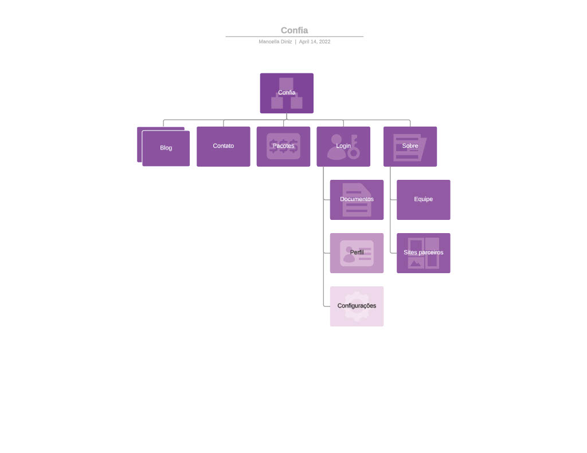
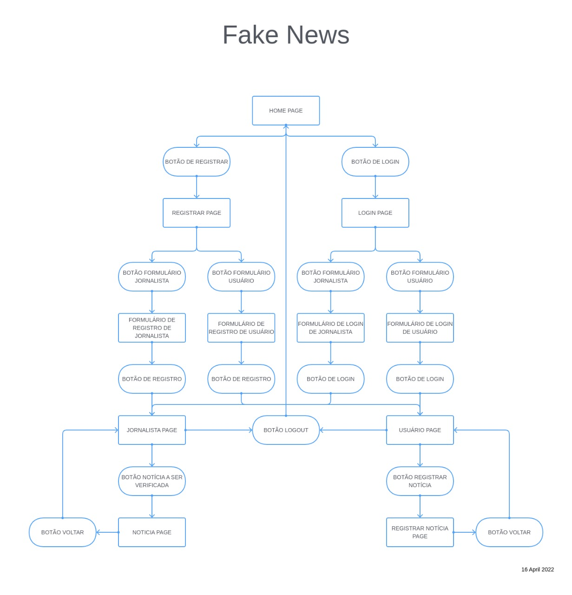
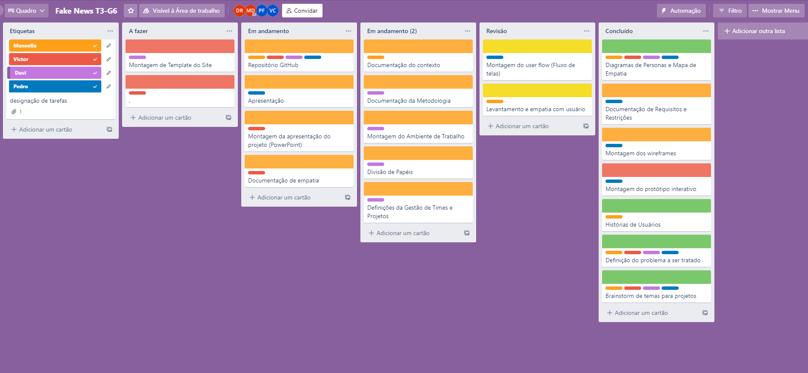

# Informações do Projeto
Confia! - Plataforma de verificação de noticias

Trabalho Interdisciplinar: Aplicacões Web | Ciência da Computação | PUC Minas

## Participantes

* Davi Rodrigues Barbosa
* Manoella Santos Diniz
* Pedro Francisco Staino Santayana
* Victor Cabral de Souza Oliveira

# Estrutura do Documento

- [Informações do Projeto](#informações-do-projeto)
  - [Participantes](#participantes)
- [Estrutura do Documento](#estrutura-do-documento)
- [Introdução](#introdução)
  - [Problema](#problema)
  - [Objetivos](#objetivos)
  - [Justificativa](#justificativa)
  - [Público-Alvo](#público-alvo)
- [Especificações do Projeto](#especificações-do-projeto)
  - [Personas e Mapas de Empatia](#personas-e-mapas-de-empatia)
  - [Histórias de Usuários](#histórias-de-usuários)
  - [Requisitos](#requisitos)
    - [Requisitos Funcionais](#requisitos-funcionais)
    - [Requisitos não Funcionais](#requisitos-não-funcionais)
  - [Restrições](#restrições)
- [Projeto de Interface](#projeto-de-interface)
  - [User Flow](#user-flow)
  - [Wireframes](#wireframes)
- [Metodologia](#metodologia)
  - [Divisão de Papéis](#divisão-de-papéis)
  - [Ferramentas](#ferramentas)

# Introdução

## Problema

A humanidade, atualmente, está conectada. Temos acesso a notícias de qualquer lugar do mundo na palma da nossa mão. Conseguimos nos comunicar de forma instantânea com outras pessoas e isso abriu portas para várias novas soluções. Porém, é muito difícil garantir que todo esse poder vai ser utilizado de forma consciente por todos os usuários da rede. Um problema causado por esse ambiente pouco regulado é a dissipação de notícias falsas, também conhecidas como  "fake news".

## Objetivos

Queremos criar uma solução que ajude a combater as chamadas "fake news". 

Além disso, temos alguns objetivos especificos:

* Convencer jovens de que é necessário a verificação de notícias recebidas.
* Criar uma plataforma que administre um selo de veracidade para notícias.

## Justificativa

De acordo com a nossa pesquisa qualitativa, cerca de 70% dos entrevistados não utilizam nenhuma ferramenta para validar as notícias que recebem, seja por redes sociais ou pela mídia tradicional. Além disso, os jovens de 14 e 17 anos são os que mais se informam utilizando redes sociais e também são os que menos tomam providência quando recebem notícias falsas.

## Público-Alvo

O público-alvo do nosso projeto são:

* Pessoas, homens e mulheres, com formação em jornalismo e com diferentes ideologias.
* Pessoas, homens e mulheres, responsáveis pelas publicações em sites de notícias.

# Especificações do Projeto

Nessa seção, será apresentada uma visão mais aprofundada do projeto, através das Personas, Histórias de Usuários, Requisitos e Restrições do projeto.

## Personas e Mapas de Empatia

## Histórias de Usuários

Com base na análise das personas forma identificadas as seguintes histórias de usuários:

|EU COMO... `PERSONA`| QUERO/PRECISO ... `FUNCIONALIDADE` |PARA ... `MOTIVO/VALOR`                 |
|--------------------|------------------------------------|----------------------------------------|
|Usuário do sistema  | Cadastrar notícia para ser verificada | Conseguir o selo da notícia         |
|Prestador de serviços  | avaliar notícia cadastrada | Receber pelos serviços prestados      |

## Requisitos

As tabelas que se seguem apresentam os requisitos funcionais e não funcionais que detalham o escopo do projeto.

### Requisitos Funcionais

|ID    | Descrição do Requisito  | Prioridade |
|------|-----------------------------------------|----|
|RF-001| Permitir o cadastro de jornalistas | ALTA | 
|RF-002| Permitir o cadastro de notícias | ALTA |
|RF-003| Permitir o login de jornalistas | ALTA |

### Requisitos não Funcionais

|ID     | Descrição do Requisito  |Prioridade |
|-------|-------------------------|----|
|RNF-001| O sistema deve ser responsivo para rodar em um dispositivos móvel | MÉDIA | 
|RNF-002| Deve processar requisições do usuário em no máximo 3s |  BAIXA | 
|RNF-003| O sistema deve disponibilizar tema claro e escuro | MÉDIA | 

## Restrições

O projeto está restrito pelos itens apresentados na tabela a seguir.

|ID| Restrição                                             |
|--|-------------------------------------------------------|
|01| O projeto deverá ser entregue até o final do semestre |
|02| Não pode ser desenvolvido um módulo de backend        |

# Projeto de Interface

* Nosso mapa do site:

## User Flow

## Wireframes

## Metodologia

A metodologia desse projeto foi feita com base na combinação dos metodos "Design Thinking"
e Scrum, utilizamos o metodo "Design Thinking" na fase inicial do projeto, e na fase de 
desenvolvimento utilizamos o Scrum.

## Divisão de Papéis

| Membro    | Função             |
|-------------------|-------------------------|
| Professores  | Product owner | 
|Manoella Santos Diniz | Deselvonvedora e Scrum Master | 
|Pedro Francisco Staino Santayana | Desenvolvedor | 
|Victor Cabral de Souza Oliveira | Desenvolvedor | 
|Davi Rodrigues Barbosa | Desenvolvedor | 

 
utizamos o Trello Para organização e distribuição das tarefas do projeto.

* Etiquetas: utilizamos a etiqueta para indicar as devidas funções de cada componente do grupo.

* A fazer: essa coluna se remete a uma Sprint que ainda precisamos fazer.

* Em andamento: se essa terefa esta sendo feita por um dos integrantes do grupo.

* revisão: assim que a pessoa acaba de fazer a terefa, ela coloca a terefa nessa coluna para realizar revisão que é feita pelos integrantes do grupo.

* Concluído: Tarefas Concluidas e revisadas pela equipe.

## Ferramentas

| Ambiente  | Plataforma              |Link de Acesso |
|-----------|-------------------------|---------------|
|Processo de Design Thinkgin  | Miro | https://miro.com/app/board/uXjVOB7DjGc=/ | 
|Repositório de código | GitHub | https://github.com/ICEI-PUC-Minas-PMGCC-TI/tiaw-pmg-cc-m-20221-tiaw-fake-news-grupo-6 | 
|Protótipo Interativo |  Figma | https://www.figma.com/file/1eI3q7wrR2CUJONs0MOvrp/Fake-News?node-id=0%3A1 | 
|Organização |  Trello | https://trello.com/b/Oj4S2FOz/fake-news-t3-g6 | 

 
 As ferramentas empregadas no projeto são:
 
 - Editor de código: VS code.
 - Ferramentas de comunicação: WhatsApp, Discord, Microsoft Teams.
 - Ferramentas de diagramação: Figma, Miro
 
 O editor de código foi escolhido pela equipe por ser um programa acessivel 
 para qualquer sistema operacional, de facil utilzação e por ser um progama
 leve. Os meios de comunicação foram escolhidos pela equipe ja possuir uma 
 grande afinidade com todos. Utilizamos o miro para o processo de design 
 Thinkgin por sugestão dos professores. Por fim, para criar o protótipo interativo 
 utilizamos o Figma por melhor captar as necessidades da nossa solução.

